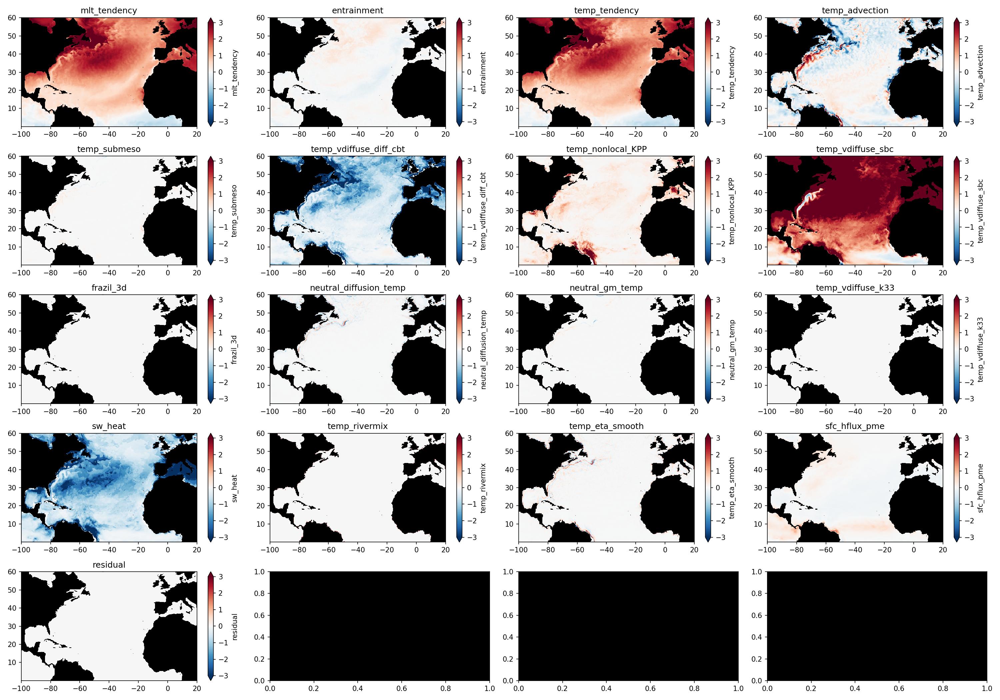
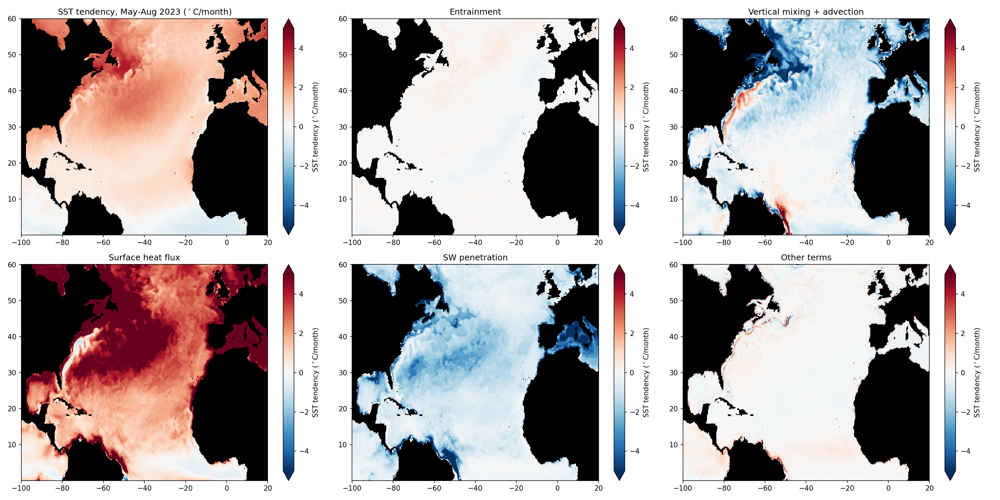
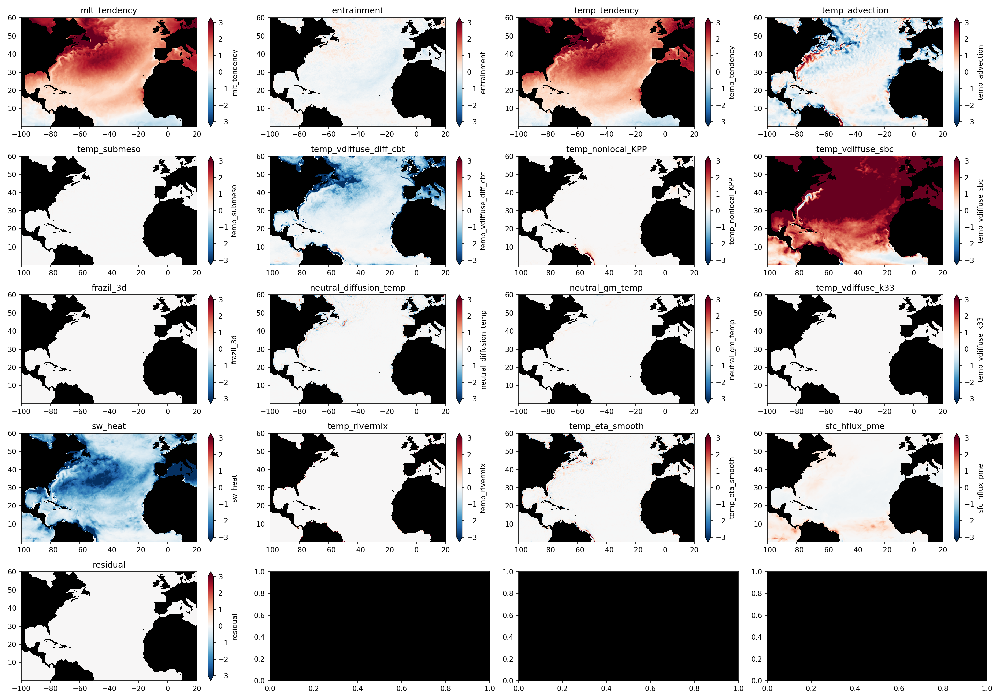
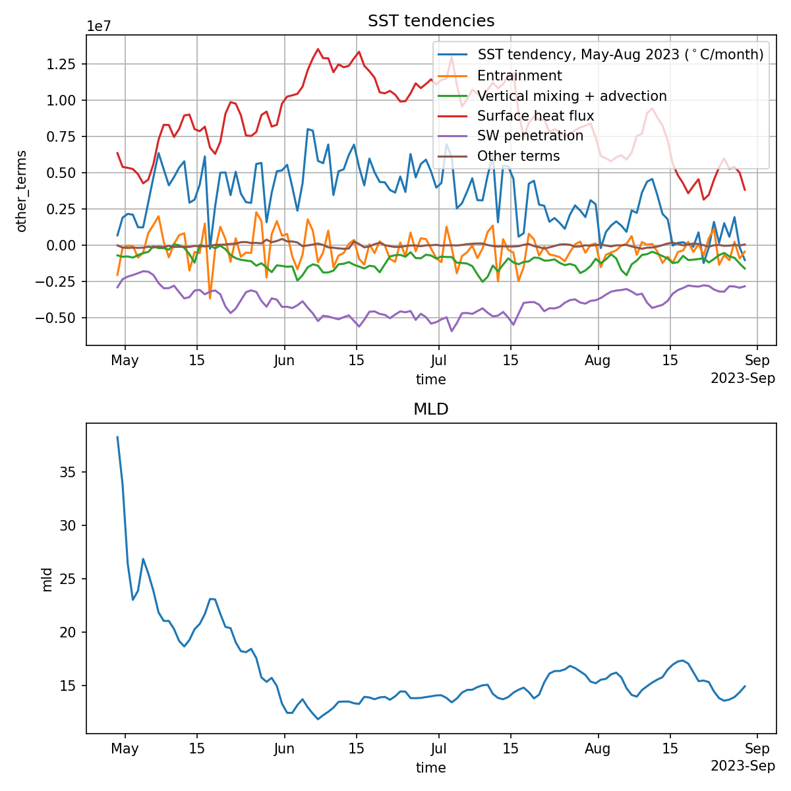

# Mixed layer heat budget analysis of ACCESS-OM2 runs

This notebook contains a quick analysis of the mixed layer heat budget in ACCESS-OM2, using online heat budget diagnostics, including the computation of the entrainment term.

See the notebook `Mixed_Layer_Heat_Budget_ACCESS-OM2.ipynb` for the theory, discussion, explanation and code.

## Required diagnostics and results for North Atlantic MHW, summer 2023

The following figure shows all the terms in the mixed layer temperature budget averaged over the months of May-Aug 2023 in the North Atlantic, using monthly-averaged diagnostics.
Units are $^\circ$C/month.

In this figure:
- `mlt_tendency` is the mixed layer temperature tendency, computed from *snapshots* of the temperature, grid cell thickness (`dzt`) and potential density `pot_rho_0` at the beginning and ending of each month. The mixed layer temperature is computed from these diagnostics using a $0.125$kgm$^{-3}$ density criterion, and using the exact time-varying grid cell thicknesses `dzt`.
- `temp_tendency` is the "fixed-depth" temperature tendency term `temp_tendency` (see the notebook for an explanation), the LHS of the models heat budget equation converted to a temperature tendency by dividing by $\rho_0$, $C_p$ and the time-averaged mixed layer depth computed with time-averaged `dzt` and `pot_rho_0`.
- `entrainment` is the entrainment term, computed by residual between `mlt_tendency` and `temp_tendency`.
- The remaining terms are all the processes on the RHS of the heat budget equation. E.g. `temp_advection` is 3D advection, `temp_vdiffuse_diff_cbt` and `temp_nonlocal_KPP` are the vertical mixing terms, `temp_vdiffuse_sbc` is the total surface heat flux, `sw_heat` is the amount of SW radiation that penetrates below the mixed layer.
- `residual` is the residual (zero, see the `_tighter_clims.png` version of the figure).

Clearly most terms are pretty small (although this may not neccessarily be true for anomalies from a climatology). The following is a simpler figure with terms grouped and the main terms shown:

These figures has required the following diagnostics:
1. Full 3D monthly-averaged heat budget diagnostics (`temp_tendency=temp_advection+...`).
2. Monthly-averaged `dzt` and `pot_rho_0` to average the heat budget diagnostics over the mixed layer depth.
3. Snapshots of `temp`, `dzt` and `pot_rho_0` at the beginning and ending of each month to compute the `mlt_tendency` term, and thus the `entrainment` term by residual from `temp_tendency`.

## When snapshots are not available

Unfortunately, the snapshots (number 3 above) required to compute the `mlt_tendency` (and thus `entrainment`) are not available from the full `omip2_cycle6` cycle. However, if one is only interested in a climatology of `mlt_tendency` (so that one can compute anomalies for 2023, where diagnostics are available), I think it should still be possible to compute this using interpolated derivatives of the *time-averaged* mixed layer temperature, since this will be pretty smooth anyway. 

Roughly, this would be done as follows:
1. Compute mixed layer temperature from monthly averages using `temp`, `dzt` and `pot_rho_0` for each month in the full climatology period.
2. Take the time derivative by a simple centered difference (these time derivatives will be centered at month transitions - e.g. around the Jan-Feb transition, Feb-Mar transition etc.).
3. Interpolate these time derivatives back to the centre of the month using a simple average.
4. Compute a climatology - i.e. average each month over the climatology period.

You should now have a climatological average of `mlt_tendency`, defined appropriately at the centre of months. The climatology of `entrainment` can then be computed by taking the residual with the climatology of the mixed layer temperature `temp_tendency`. Finally, these climatologies can be subtracted from the absolute values for the months of interest (e.g. 2023) to yield an anomaly budget.

Note: the action of taking time derivatives and then time averages in steps 2 and 3 above will mean you lose months at either end of the time period. As long as your climatology period is shorter than the total simulation length this shouldn't be a problem.

I'll leave doing this one to the reader :).

## Comparing monthly vs. daily-averaged diagnostics

The above budget is not fully accurate since it neglects correlations between submonthly variations in the heat budget diagnostics (`temp_tendency` etc.) and the mixed layer depth.
To check whether this introduces a significant error, the notebook contains a similar computation but using daily averaged diagnostics.
The results are shown in the below figure.

Comparing this figure to the above monthly-averaged figure, you can see some differences but they don't appear to be first-order. The mixed layer temperature tendency term is identical (because it's computed from snapshots at the beginning and ending of the entire time period), while the terms in the budget do change somewhat. 

This could and should be quantified more precisely.

Just for reference, here is a time series over the daily budget terms averaged between 80-20$^\circ$W, $10-40^\circ$N:

