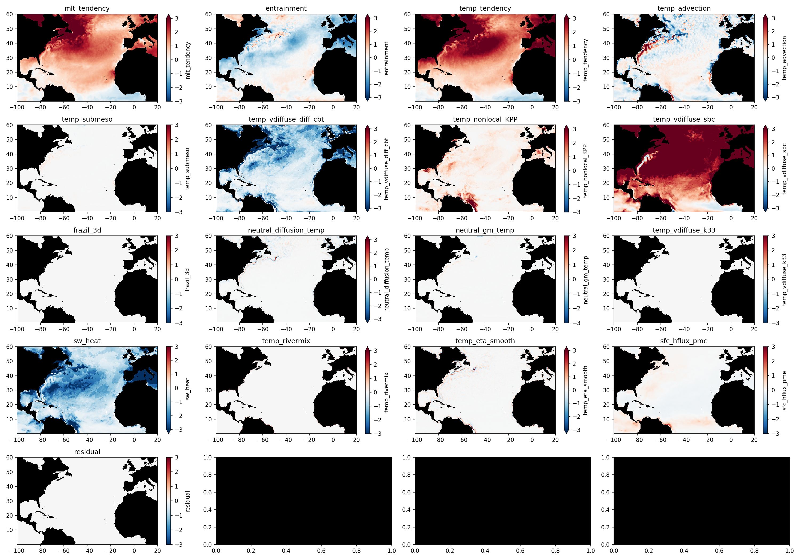

# Mixed layer heat budget analysis of ACCESS-OM2 runs

This notebook contains a quick analysis of the mixed layer heat budget in ACCESS-OM2, using online heat budget diagnostics, including the computation of the entrainment term.

See the notebook `Mixed_Layer_Heat_Budget_ACCESS-OM2.ipynb` for the theory, discussion, explanation and code.

## Required diagnostics and results for North Atlantic MHW, summer 2023

The following figure shows all the terms in the mixed layer temperature budget averaged over the months of May-July 2023 in the North Atlantic, using monthly-averaged diagnostics.
Units are $^\circ$C/month.

In this figure:
- `mlt_tendency` is the mixed layer temperature tendency, computed from *snapshots* of the temperature, grid cell thickness (`dzt`) and potential density `pot_rho_0` at the beginning and ending of each month. The mixed layer temperature is computed from these diagnostics using a $0.125$kgm$^{-3}$ density criterion, and using the exact time-varying grid cell thicknesses `dzt`.
- `temp_tendency` is the "fixed-depth" temperature tendency term `temp_tendency` (see the notebook for an explanation), the LHS of the models heat budget equation (converted to a temperature tendency by dividing by the time-averaged mixed layer depth computed with time-averaged `dzt` and `pot_rho_0`).
- `entrainment` is the entrainment term, computed by residual between `mlt_tendency` and `temp_tendency`.
- The remaining terms are all the processes on the RHS of the heat budget equation. E.g. `temp_advection` is 3D advection, `temp_vdiffuse_diff_cbt` and `temp_nonlocal_KPP` are the vertical mixing terms, `temp_vdiffuse_sbc` is the total surface heat flux, `sw_heat` is the amount of SW radiation that penetrates below the mixed layer.
- `residual` is the residual (zero, see the `_tighter_clims.png` version of the figure).

This figure has required the following diagnostics:
1. Full 3D monthly-averaged heat budget diagnostics (`temp_tendency=temp_advection+...`).
2. Monthly-averaged `dzt` and `pot_rho_0` to average the heat budget diagnostics over the mixed layer depth.
3. Snapshots of `temp`, `dzt` and `pot_rho_0` at the beginning and ending of each month to compute the `mlt_tendency` term, and thus the `entrainment` term by residual from `temp_tendency`.

## When snapshots are not available

Unfortunately, the snapshots (number 3) required to compute the `mlt_tendency` (and thus `entrainment`) are not available from the full `omip2_cycle6` cycle. However, if one is only interested in a climatology of `mlt_tendency` (so that one can compute anomalies for 2023, where diagnostics are available), I think it should still be possible to compute this using interpolated derivatives of the *time-averaged* mixed layer temperature, since this will be pretty smooth anyway. 

XXX TODO

## Comparing monthly vs. daily-averaged diagnostics

The above budget is not fully accurate since it neglects correlations between submonthly variations in the heat budget diagnostics (`temp_tendency` etc.) and the mixed layer depth.
To check whether this introduces a significant error, the notebook contains a similar computation but using daily averaged diagnostics.
The results are shown in the below figure.

XXX to do

